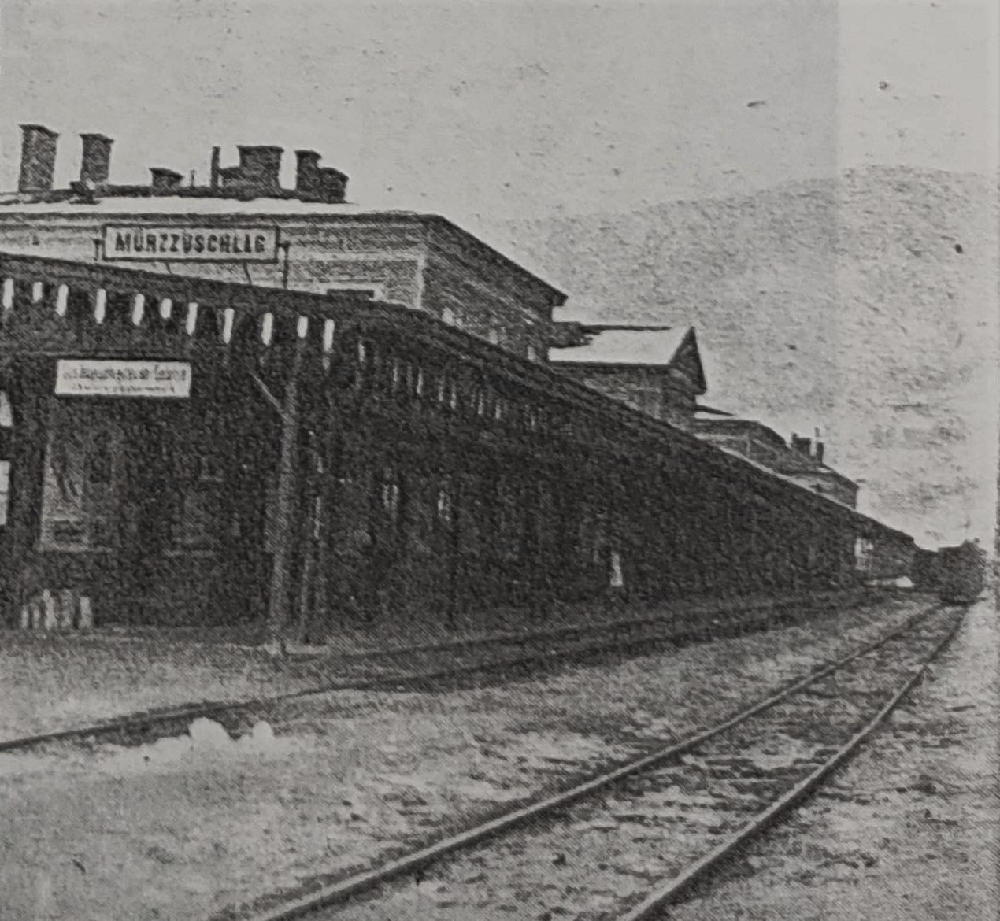

<body>
    

        <h1  id="title">{{ page.title }}</h1>
        
 {{ page.image-descr }}

        
Trotz der relativ hohen Kosten ermöglichte ein Abkommen mit den Bundesbahnen ÖBB den Anreisenden von billigeren Preisen auf deren Zugverbindungen, aber auch auf Ermäßigungen auf einigen Regionalbahnen zu profitieren (Arbeiterwille 1930, S. 4). Teilnehmer erhielten 25% auf den regulären Fahrkartenpreis. Diese Vergünstigung galt für zwei Wochen: Jede Fahrt nach Mürzzuschlag konnte frühestens am 1. Februar angetreten werden, und das Ziel musste spätestens am 8. Februar um Mitternacht erreicht werden. Die Rückfahrt konnte nicht vor dem 5. Februar um Mitternacht angetreten werden und musste am 15. Februar um Mitternacht beendet worden sein, sofern das Reiseziel in Österreich lag (Gastgeb 1931, S. 28). Wenn man aus dem Ausland anreiste, empfahlen die Veranstalter Fahrkarten über Reisebüros zu kaufen. Darüber hinaus konnten sich Reisegruppen junger Leute über 50% Ermäßigung freuen. Das gleich galt für jene, die nicht in Mürzzuschlag nächtigten, sondern aus der näheren Umgebung jeden Tag zu den Wettbewerben anreisten. Eine gültige Zuschauerkarte für die Spiele war Voraussetzung für die ermäßigten Preise (Gastgeb 1931, S. 28).

        
Allerdings waren die Bundesbahnen von den Spielen nicht angetan. Nach einer Absage entschieden sie kurzfristig, dass der Bahnhof Mürzzuschlag doch geschmückt werden dürfe, aber nur in rot-weiß-rot (die österreichischen Nationalfarben) und grün-weiß (die Farbe der Steiermark); rot für die Sozialisten war verboten. Außerdem war es nicht erlaubt den Wartebereich für die Zugreisenden zweiter Klasse als einen Empfangsraum für nationale und internationale Gäste zu nutzen. Aufgrund dieser Entscheidungen der ÖBB entschieden sich die Veranstalter schließlich, auf jede Dekoration zu verzichten (Der Abend, 3. Februar 1931, S. 6).

        
 {{ page.image-descr2 }}

        
Für Teilnehmer aus dem Ausland war es besonders schwierig das Geld aufzutreiben um an den Wettbewerben teilzunehmen. Zum Beispiel wusste das deutsche Team im Jänner 1931 immer noch nicht, wie viel finanzielle Unterstützung sie vom Staat für die Teilnahme an der Winter- und Sommerolympiade bekommen würden. Scheinbar wurde der Arbeitersport weitgehend ignoriert, denn das bürgerliche Olympische Komitee hatte bereits 50.000 RM (Reichsmark) für die Olympischen Spiele in Los Angeles 1932 erhalten, und rechnete mit weiteren <a href="#" class="link-info" data-toggle="tooltip" title="Der durchschnittliche Arbeiter verdiente 192RM im Monat">100.000 Reichsmark</a> für die Unterstützung der Turner. 

        
Die Situation war in anderen Ländern besser. Zum Beispiel hatte das finnische Team die großzügige Summe von 300000 finnischen Mark für ihr Vorhaben erhalten. Dann wiederum hatte das ungarische Team geprahlt mindestens 60 Athleten zu schicken, aber nur ein Bruchteil konnte tatsächlich nach Mürzzuschlag kommen aufgrund fehlender finanzieller Mittel (Oesterreichische Arbeiter-Turn- und Sport-Zeitung January 1931, S. 10).
        Wie man sieht war es nicht nur schwierig, Zeit für die Teilnahme zu haben, sondern auch die Kosten schränkten die Teilnehmer und ihre Verein ein. Man musste sich auf die Finanzierung durch die Gemeinschaft verlassen, was die Zahl derer, die man zu Wettbewerben aussenden konnte, einschränkte. Davon waren besonders internationale Wettbewerbe wie die Olypiaden in Mürzzuschlag und Wien betroffen, die mit hohen Reise- und <a href="#" class="link-info" data-toggle="tooltip" title="Nur wenige Sportler konnten sich teuere Sportarten wie Schifahren leisten. Sportarten wie Laufen, Schwimmen oder Turnen waren viel häufiger.">Ausrüstungskosten</a> verbunden waren.

        

            
{{ site.data.snippets.sources[page.lang] }}:

            <ul>
                <li>Anon, 1931. Rundschau. Oesterreichische Arbeiter-Turn- und Sport_Zeitung, January 1931, p. 10</li>
                <li>Gastgeb, H., 1931. Wichtige Bestimmungen für Fahrbegünstigungen auf den Österreich. Bundesbahnen, Aspangbahn, Graz-Köflacher und Zillertaler Bahn. Festführer. Presseausschuß der Arbeiter-Olympiade, Vienna. p. 28</li>
                <li>Anon, 1930. Weitere Fahrbegünstigungen und Besuche der Winterolympiade.Der Arbeiterwille, Nr 344, Graz, 15 Dec 1930, p. 4, [online] Available at: <a href="https://anno.onb.ac.at/cgi-content/anno?aid=awi&datum=19301215&seite=4&zoom=33&query=%22arbeiterolympiade%22%2B%22m%C3%BCrzzuschlag%22&ref=anno-search">https://anno.onb.ac.at/cgi-content/anno?aid=awi&datum=19301215&seite=4&zoom=33&query=%22arbeiterolympiade%22%2B%22m%C3%BCrzzuschlag%22&ref=anno-search</a> [accessed 29 August 2021]</li>
                <li>Mars. 1931. Das heiß Förderung des Fremdenverkehrs. Der Abend, No 27, 17th year, 3rd Feb 1931, p. 6, [online] Available at: <a href="https://anno.onb.ac.at/cgi-content/anno?aid=abd&datum=19310203&seite=6&zoom=33&query=%22arbeiterolympiade%22%2B%22m%C3%BCrzzuschlag%22&ref=anno-search">https://anno.onb.ac.at/cgi-content/anno?aid=abd&datum=19310203&seite=6&zoom=33&query=%22arbeiterolympiade%22%2B%22m%C3%BCrzzuschlag%22&ref=anno-search</a> [accessed 29 August 2021]</li>
                <li>Anon, n.d. Monthly salary of a worker in Germany in 1931: 192RM, [online] Available at: <a href="https://www.was-war-wann.de/historische_werte/monatslohn.html">https://www.was-war-wann.de/historische_werte/monatslohn.html</a></li>
            </ul>
        

        

            
{{ site.data.snippets.pics[page.lang] }}:

            <ul>
                <li>Anon, 1931. Train station in Mürzzuschlag. (Volkssport, 15 February 1931, p. 2)</li>
                <li>Aktionsausschuss, 1931. Festteilnehmerkarte. (Winter!Sport!Museum!, Mürzzuschlag)</li>
            </ul>
        

    

</body>