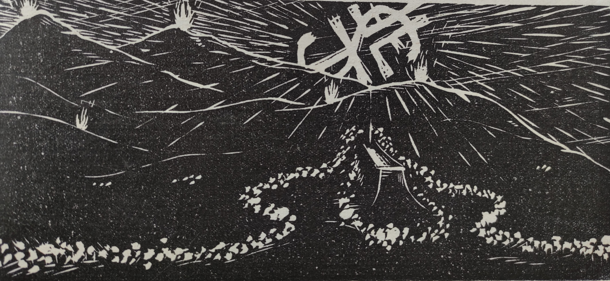

<body>
  

    <h1  id="title">{{ page.title }}</h1>
    
{{ page.image-descr2 }}

    
Free events were open to everyone. One of the most notable was the so-called Fackelzug (torch parade). As night fell, athletes and organisers moved in a parade through the town, ending their walk at the Ganzsteinschanze, illuminating the area with torches (Hüttenegger, 1931, p.1). Simultaneously, fires were light on the mountaintops across, creating an impressive sight. The following night, the audience was entertained by special athletic performances of the figure skaters at the ice-skating rink.

    
{{ page.image-descr }}

    
Most people came for the sports, and there was sufficient space in brochures to note down the results of the competitions. Some people even placed bets on winning teams. In addition, there was a need to create sufficient after-competition-events that would appeal to a culturally interested audience. However, only a fraction of the 8000 spectators (Das Kleine Blatt, 7 Feb 1931, p.6) was able to participate in these events if they were held indoors. Everyone who wanted to enjoy the concerts, acts and presentations needed tickets. Those who had an event pass could participate in one of the evening events, depending on capacity. This was included in the ticket price of 1.50 or 3.50 Shillings. The opening ceremony and the closing ceremony were invitation-only.
  
    
Nevertheless, the event programme was a showcase of the working class cultural efforts, ranging from concerts, to political cabaret and other art performances. But, was it affordable for the general public? Please refer to the price list below!

  <section class="vh-30" style="background-color: #eee;">
    

      

        

          <figure class="bg-white p-3 rounded" style="border-left: .25rem solid #a34e78;">
            <blockquote class="blockquote pb-2">
              

                  <h2 id="quotetitle">Eintrittspreise</h2>
                  <ul>
                      <li>A.	Die Inhaber von Teilnehmerkarten haben zu den sportlichen Veranstaltungen und zu den Festabenden freien Zutritt</li>
                      <li>B.	Dauerkarten zu allen sportlichen Veranstaltungen (Ganzsten und Eislaufplatz) S 2–.</li>
                      <li>C.	Tageskarte für die Festplätze S 1–.</li>
                      <li>D.	Eintritt zu einer der festlichen Veranstaltungen S1 – (nur nach Maßgabe der vorhandenen Plätze).</li>
                  </ul>
              

            </blockquote>
            <figcaption class="blockquote-footer mb-0 font-italic">
              Festführer, 1931, p.6, 1931
            </figcaption>
          </figure>
        

      

    

  </section>
    

      
Resources:

          <ul>
              <li>Gastgeb, H. 1931. Festführer. Presseausschuß der Arbeiter-Olympiade, Vienna.</li>
              <li>Hüttenegger, T. 1931. Turngenossinnen, Turngenossen, Arbeiter-Wintersportler! Oesterreichische Arbeiter-Turn- und Sport-Zeitung, January 1931. p.1</li>
              <li>Anon. 1931. Fünftausend Gäste in Mürzzuschlag. Das Kleine Blatt, 7 Feb 1931, p.6</li>
          </ul>
    

    

      
Pictures:

          <ul>
            <li>Hüttenegger, T., Püchler, 1931. Torchparade Woodcut (Oesterreichische Arbeiter-Turn- und Sport-Zeitung, January 1931. p.1)</li>
            <li>Anon, 1931. Competitor no.2 crosses the finish line and spectators watch with leaflets in hand (Winter!Sport!Museum!, Mürzzuschlag)</li>
          </ul>
    

  

</body>