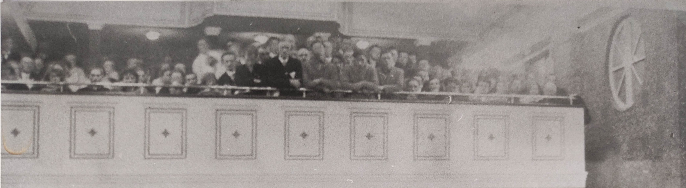

<body>
    

        <h1  id="title">{{ page.title }}</h1>
        
Spectators at an evening event

        
While most people came for the sports, there was a need to create sufficient after-competition-events that would appeal to a culturally interested audience. However, only a fraction of the 8000 spectators (Das Kleine Blatt, 7 Feb 1931, p6) was able to participate in these events if they were held indoors. Everyone who wanted to enjoy the concerts, acts and presentations needed tickets. Those who had an event pass could participate in one of the evening events, depending on capacity. This was included in the ticket price of 1.50 or 3.50 Shillings. The opening ceremony and the closing ceremony were invitation-only.

        
Three venues were used on four consecutive days. Below, you can find a list of events and links to some of the music that was played on each night.

    

</body>