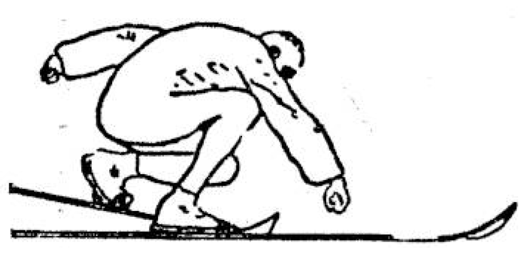

<body>
    

        <h1  id="title">{{ page.title }}</h1>
        
{{ page.image-descr }}

        
 Caricature of Talsi finishing his jump. Das Kleine Blatt, 9 February 1931

        

            
Next to competing and winning for their respective areas, there was a strong understanding that the international solidarity of the working-class movement should be visible. Therefore, the athletes took part in two parades through town on 7th February 1931, and 8th February 1931, the last day of the competition. The first parade was a so-called “Fackelzug”, a torchlight parade that would illuminate the whole town and predominantly served a symbolic purpose. Its destination was the ice rink where the masses could celebrate. According to the Oesterreichische Arbeiter-Turn- und Sport-Zeitung (2/1931), 3000 torchbearers were watched by a 6000-strong crowd. When Julius Deutsch held his speech on solidarity and the struggles of the working class, the mountaintops around the town were illuminated by fires that could be seen from afar. The combination of fire, snow and ice must have been truly impressive on everybody who was present at the event.

        

        
{{ page.image-descr2 }}

        

            
The parade on 8th February 1931 took the competitors straight to the last event of the Olympiad at the Ganzsteinschanze, the ski jump. There was a strict order for all participants, and everyone had to be ready to leave by 12pm, stewards with red ribbons oversaw the order was kept. When the parade started, the children were followed by the honorary guests. Then followed the athletes from abroad and the parade was closed by the large group of participants from Austria (Gastgeb 1931, p.13). The athletes who competed in the final ski jump too their equipment with them, others carried socialist red flag or flags that represented their countries. Reports of the day state that up to 8000 people joined the parade and at least the same amount of people watched the athletes on their way to the ski jump where Julius Deutsch would mark final words on the event (Oesterreichische Arbeiter-Turn- und Sport-Zeitung, p. 17-18). Das Kleine Blatt speaks of 12.000 people in Mürzzuschlag (Das Kleine Blatt, 9 February 1931, p. 12)

        

        

            
Resources

                <ul>
                    <li>Anon, 1931. Im Kampf mit Schnee und Eis. Das Kleine Blatt, 9 February 1931, p. 11</li>
                    <li>Anon, 1931. Die 2. Arbeiterolympiade in Mürzzuschlag, Oesterreichische Arbeiter- Turn- und Sport-Zeitung, pp. 14-19.</li>
                    <li>Anon, 1931. Finish in Mürzzuschlag. Das Kleine Blatt, 9 February 1931, p. 12</li>
                    <li>Gastgeb, H., Aufmarschplan zum Festzug. Festführer, Vienna: Presseausschuß der Arbeiter-Olympiade, p. 13</li>
                </ul>
        

        

            
Pictures

                <ul>
                    <li>Anon, 1931. Talsi, caricature. (Das Kleine Blatt, 9 February 1931)</li>
                    <li>Anon, 1931. Talsi jumps to victory. (Winter!Sport!Museum!, Mürzzuschlag)</li>
                    <li>Photo Ingbro, 1931. Final parade with political figues. (Winter!Sport!Museum!, Mürzzuschlag)</li>
                </ul>
        

    

</body>